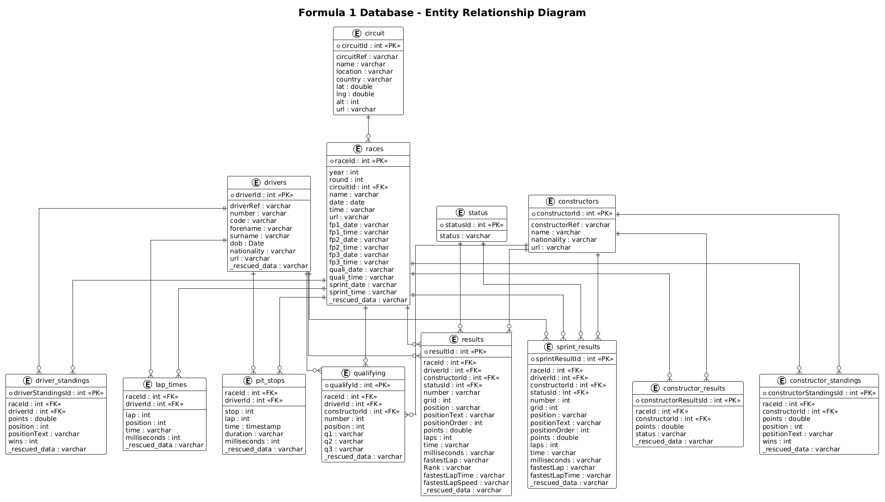

# F1 Analytics Platform

> **Stack:** dbt Core · Databricks · Delta Lake · Unity Catalog · Python
>
> An end-to-end analytical data pipeline for Formula 1 racing, built as a portfolio project to demonstrate real-world data engineering and analytics engineering skills — from raw ingestion all the way to business-ready data marts.

---

## Table of Contents

1. [Project Overview](#1-project-overview)
2. [Tech Stack](#2-tech-stack)
3. [Architecture](#3-architecture)
4. [Source Data](#4-source-data)
5. [Bronze Layer — Raw Ingestion](#5-bronze-layer--raw-ingestion)
6. [Silver Layer — Cleaned & Enriched](#6-silver-layer--cleaned--enriched)
7. [Gold Layer — Analytics-Ready](#7-gold-layer--analytics-ready)
8. [Seeds — Reference Data](#8-seeds--reference-data)
9. [Snapshots — SCD Type 2](#9-snapshots--scd-type-2)
10. [Testing Strategy](#10-testing-strategy)
11. [Skills Demonstrated](#11-skills-demonstrated)

---

## 1. Project Overview

**Phase 1 — Complete ✅**

A fully implemented Medallion Architecture data pipeline covering:

- **Ingestion** of raw F1 CSV data into Delta Lake tables (Bronze)
- **Cleaning, deduplication, type casting, and enrichment** of core entities (Silver)
- **Dimensional modelling** with fact tables and analytical data marts (Gold)
- **SCD Type 2 tracking** of team rebrands and driver nationality changes (Snapshots)
- **Seed-based reference data** for team lineage and race finish statuses

The pipeline is designed to support analytics and reporting on F1 race performance — driver and constructor statistics, qualifying trends, pit stop efficiency, and lap-by-lap race data spanning the entire history of the championship (1950–2024).

---

## 2. Tech Stack

| Component | Technology |
|---|---|
| Data Platform | Databricks |
| Storage Format | Delta Lake |
| Catalog | Unity Catalog |
| Transformation Layer | dbt Core |
| Source Data | Kaggle F1 Dataset (CSV) |
| Architecture Pattern | Medallion (Bronze → Silver → Gold) |
| Language | SQL (Spark SQL / Databricks dialect) |
| Package Manager | uv (Python) |

---

## 3. Architecture

### Catalog Structure

```text
f1_championship (Unity Catalog)
├── source          ← Raw CSV files loaded into Databricks Volumes
├── bronze          ← Raw Delta tables (minimal transformation, full fidelity)
├── silver          ← Cleaned, deduplicated, type-cast, and enriched tables
├── gold
│   ├── dimensions  ← Conformed dimension tables (dim_*)
│   ├── facts       ← Grain-level fact tables (fct_*)
│   └── marts       ← Aggregated reporting tables (mart_*)
├── snapshots       ← SCD Type 2 historical tracking tables
└── reference       ← dbt Seeds (static lookup / reference data)
```

### Schema Configuration

All schemas are parameterised in `dbt_project.yml` to support environment flexibility:

```yaml
vars:
  catalog: "f1_championship"
  source_schema: "source"
  bronze_schema: "bronze"
  silver_schema: "silver"
  gold_schema: "gold"
  reference_schema: "reference"
  source_volume: "raw_file"
```

A custom `generate_schema_name` macro ensures schemas are written exactly as configured — overriding dbt's default behaviour of prefixing schema names with the target schema.

### Data Flow

```
Kaggle CSVs
    ↓  (manual upload)
Databricks Volume (raw_file)
    ↓  (bronze models)
bronze.*          ← 13 Delta tables, raw data preserved
    ↓  (silver models + seeds)
silver.*          ← 15 Delta tables, cleaned and enriched
    ↓  (gold models)
gold.dimensions   ← 4 conformed dimensions (dim_*)
gold.facts        ← 4 fact tables (fct_*)
gold.marts        ← 2 aggregated data marts (mart_*)
    ↓
snapshots.*       ← SCD Type 2 on constructor lineage and drivers
```



---

## 4. Source Data

**Source:** [Formula 1 World Championship (1950–2020) — Kaggle](https://www.kaggle.com/datasets/rohanrao/formula-1-world-championship-1950-2020)

The dataset has been updated to include races through the **2024 season**. It covers the complete history of F1 across 13 CSV files:

| File | Description |
|---|---|
| `circuits.csv` | Circuit names, locations, coordinates |
| `constructors.csv` | Team names, nationalities, Wikipedia URLs |
| `drivers.csv` | Driver details, DOB, nationalities |
| `seasons.csv` | Season years and Wikipedia references |
| `races.csv` | Race calendar — circuit, date, round per season |
| `results.csv` | Full race results per driver per race |
| `sprint_results.csv` | Sprint race results (2021 onwards) |
| `qualifying.csv` | Qualifying session lap times (Q1/Q2/Q3) |
| `lap_times.csv` | Lap-by-lap timing per driver per race |
| `pit_stops.csv` | Pit stop timing records |
| `driver_standings.csv` | Championship standings snapshot per race |
| `constructor_standings.csv` | Constructor standings snapshot per race |
| `constructor_results.csv` | Points per constructor per race |

CSVs are manually uploaded to a Databricks Unity Catalog Volume and read as external sources into the Bronze layer.

---

## 5. Bronze Layer — Raw Ingestion

**Purpose:** Ingest raw CSV data into Delta Lake tables with no transformations. Preserves the original data exactly as received for full traceability and reprocessability.

**Materialization:** `table`

**Models (13):**

| Model | Source CSV | Primary Key |
|---|---|---|
| `bronze_circuits` | `circuits.csv` | `circuitId` |
| `bronze_constructors` | `constructors.csv` | `constructorId` |
| `bronze_drivers` | `drivers.csv` | `driverId` |
| `bronze_seasons` | `seasons.csv` | `year` |
| `bronze_races` | `races.csv` | `raceId` |
| `bronze_results` | `results.csv` | `resultId` |
| `bronze_sprint_results` | `sprint_results.csv` | `resultId` |
| `bronze_qualifyings` | `qualifying.csv` | `qualifyId` |
| `bronze_lap_times` | `lap_times.csv` | `raceId` + `driverId` + `lap` |
| `bronze_pit_stops` | `pit_stops.csv` | `raceId` + `driverId` + `stop` |
| `bronze_driver_standings` | `driver_standings.csv` | `driverStandingsId` |
| `bronze_constructor_standings` | `constructor_standings.csv` | `constructorStandingsId` |
| `bronze_constructor_results` | `constructor_results.csv` | `constructorResultsId` |

**Tests:** `not_null` + `unique` on primary keys. Foreign key nullability warnings on `raceId`, `driverId`, and `constructorId` — non-blocking (`severity: warn`) to avoid failing on known source data gaps.

---

## 6. Silver Layer — Cleaned & Enriched

**Purpose:** Apply consistent transformations to produce clean, strongly-typed, analytics-ready data:

1. **Deduplication** — `ROW_NUMBER()` window function partitioning on natural keys to remove duplicates introduced by CSV re-exports
2. **Type casting** — All IDs cast to `INTEGER`; coordinates to `DECIMAL`; dates/times to native `DATE`/`TIME`/`INTERVAL` types; milliseconds to `INT`
3. **Null handling** — `NULLIF(TRIM(...), '')` pattern used consistently; `COALESCE` for default substitutions on critical fields
4. **Lineage enrichment** — Constructor identity enriched with team rebrand/succession data from `seed_constructor_lineage`

**Materialization:** `table`

**Models (15):**

| Model | Key Transformation Notes |
|---|---|
| `silver_circuits` | Deduplication, lat/lng/alt type casting |
| `silver_drivers` | Deduplication, DOB cast to DATE, null-safe number/code handling |
| `silver_driver_num` | **See design note below** — driver race number history by year |
| `silver_constructors` | **See design note below** — lineage enrichment, non-unique grain |
| `silver_seasons` | Passthrough with type consistency |
| `silver_races` | Date/time casting, deduplication |
| `silver_results` | Position casting, fastest lap time to milliseconds, resultCode extraction |
| `silver_sprint_results` | Same pattern as results, sprint-specific fields |
| `silver_qualifyings` | Q1/Q2/Q3 converted from `M:SS.sss` string to **total seconds as DOUBLE** |
| `silver_lap_times` | Lap time string to `INTERVAL`, milliseconds as `INT` |
| `silver_pit_stops` | Pit stop duration to `INTERVAL` and `INT` milliseconds |
| `silver_driver_standings` | Points to `DECIMAL`, deduplication |
| `silver_constructor_standings` | Points to `DECIMAL`, deduplication |
| `silver_constructor_results` | Points to `DECIMAL`, status code extraction |

### Design Note — `silver_constructors` (Non-Unique Grain)

The raw `constructors` CSV treats each `constructorId` as a unique team identity. In reality, F1 teams change names (rebrands), get bought out (successions), and sometimes return after years away — none of which is captured in the raw data.

`silver_constructors` deliberately has a **one-row-per-constructor-era grain**: a constructor that left and returned (e.g. Renault 2002–2011, then Alpine/Renault 2016–2020) appears as multiple rows. It is enriched with columns from `seed_constructor_lineage`:

| Column | Purpose |
|---|---|
| `team_lineage_id` | Groups rebrands of the same team under one ID |
| `root_team_name` | The original "brand" name for the lineage group |
| `lineage_sequence` | 1 = original name, 2 = first rebrand, etc. |
| `predecessor_lineage_id` | For succession teams — links back to the acquired entry |
| `succession_type` | `buyout`, `team_purchase`, or `license_transfer` |
| `is_rebrand` | `TRUE` if same team, new name |
| `is_successor_team` | `TRUE` if acquired another team's entry |
| `is_current_name` | `TRUE` if `rebrand_year_end IS NULL` (still racing under this name) |

Constructors not in the lineage seed receive graceful fallbacks (`team_lineage_id = constructorRef || '_lineage'`, `lineage_sequence = 1`).

### Design Note — `silver_driver_num`

Driver numbers in the `drivers` table are often static or outdated. The `results` table is a significantly higher-fidelity source — it records the actual number a driver raced under in every race. `silver_driver_num` derives driver number history directly from `results`, tracking:

- **What number** a driver used per season
- **When** they first and last used that number that year
- **How many races** they raced with it

This enables accurate historical lineage of driver numbers (e.g., drivers who changed numbers after winning the championship) and powers the `current_number` field in `dim_drivers`.

---

## 7. Gold Layer — Analytics-Ready

**Purpose:** Produce business-level data structures organised as a star schema for BI tool compatibility and analytical querying. The Gold layer is the primary consumption layer for dashboards, reports, and ad-hoc analysis.

**Materialization:** `table` | **Tags:** `dimension`, `fact` / `gold`, `marts`

---

### 7.1 Dimensions

Conformed dimensions with consistent `snake_case` column naming, primary key tests (not_null + unique), and referential integrity checks back to Silver.

| Model | Description |
|---|---|
| `dim_circuits` | Circuit locations, coordinates, country |
| `dim_drivers` | Driver identity, nationality, DOB, current race number, active status |
| `dim_constructors` | Constructor identity with full lineage flags from Silver |
| `dim_races` | Race calendar — season, round, circuit, date/time |

**Notable:** `dim_drivers` joins `silver_driver_num` to surface the driver's most recent race number (`current_number`) and their last active season (`last_race_season`). `is_active = TRUE` is set when `last_race_season = 2024`, reflecting the static end date of the current dataset.

**Notable:** `dim_constructors` carries forward all lineage enrichment from Silver — `team_lineage_id`, `is_rebrand`, `is_successor_team`, `is_current_name` — enabling lineage-aware filtering in all downstream models.

---

### 7.2 Facts

Grain-level fact tables following a **star schema** design. Each fact table explicitly denormalises `circuit_id` and `constructor_id` directly into the row — reducing the need for extra joins in BI tools and enabling single-table analytics.

| Model | Grain | Key Foreign Keys |
|---|---|---|
| `fct_results` | One row per driver per race | `race_id`, `driver_id`, `constructor_id`, `circuit_id` |
| `fct_qualifyings` | One row per driver per qualifying | `race_id`, `driver_id`, `constructor_id`, `circuit_id` |
| `fct_lap_times` | One row per driver per lap per race | `race_id`, `driver_id`, `constructor_id`, `circuit_id` |
| `fct_pit_stops` | One row per pit stop per driver per race | `race_id`, `driver_id`, `constructor_id`, `circuit_id` |

`fct_results` additionally resolves `statusId` to a human-readable `finish_status_code` (e.g. `Finished`, `Accident`, `DNF`) by joining the `status` seed at the Gold layer.

All time/duration fields are expressed in **seconds** (converted from raw milliseconds) for analytical convenience.

---

### 7.3 Data Marts

Pre-aggregated summary tables for common analytical use cases — one row per entity per season.

**`mart_constructors_season_stats`** — Season-level team performance summary:

| Column | Description |
|---|---|
| `total_races` | Races participated in that season |
| `total_points` | Championship points accumulated |
| `total_wins` | Race wins (P1 finishes) |
| `total_podiums` | Top-3 finishes |
| `finish_rate` | Proportion of races completed without retirement |
| `total_1_2_finishes` | Races where both cars finished in the top 2 simultaneously |

**`mart_drivers_season_stats`** — Season-level driver performance summary:

| Column | Description |
|---|---|
| `total_races` | Races entered that season |
| `total_points` | Championship points scored |
| `avg_start_position` | Average grid position |
| `avg_finish_order` | Average finishing order |
| `total_wins` / `total_podiums` | Wins and podiums |
| `total_points_finish` | Top-10 finishes |
| `total_p1_starts` | Pole position starts |
| `finish_rate` | Race completion rate |
| `avg_qualifying_position` | Average qualifying result |
| `total_q3_appearances` | Q3 qualifying appearances |

---

## 8. Seeds — Reference Data

Static CSV files version-controlled in the repository and loaded into the `reference` schema.

### `seed_constructor_lineage`

The most architecturally significant seed. Encodes the **real-world identity relationships** of F1 teams across the entire history of the championship:

- **Rebrands** — Same legal team, new commercial name (e.g. Toro Rosso → AlphaTauri → RB). These share a `team_lineage_id` so stats can be combined across name changes.
- **Successions** — A new entity that purchased a team's grid entry (e.g. BMW → Sauber). These receive a new `team_lineage_id` but link to the predecessor via `predecessor_lineage_id`.

This seed is the backbone of the constructor lineage system in `silver_constructors` and is tracked historically via `snapshot_constructor_lineage`.

> **Note:** `constructor_ref = 'sauber'` appears twice — once for the original Sauber era (1993–2005) and again for the post-BMW Sauber era (2010–ongoing). This is intentional and the `unique` test is omitted for this column accordingly.

### `status`

Maps opaque `statusId` integers from the raw results tables to human-readable finish status strings (e.g. `Finished`, `Accident`, `Engine`, `Disqualified`). Used in `fct_results` to populate `finish_status_code`.

---

## 9. Snapshots — SCD Type 2

Implements Slowly Changing Dimension Type 2 tracking using dbt's `check` strategy.

### `snapshot_constructor_lineage`

Tracks the editorial history of `seed_constructor_lineage`. When the seed CSV is updated (e.g. a new rebrand or succession is added mid-season), this snapshot captures the previous state before changes took effect.

- **Source:** `seed_constructor_lineage`
- **Unique Key:** `constructor_ref` + `rebrand_year_start`
- **Strategy:** `check`
- **Tracked Columns:** `team_lineage_id`, `root_team_name`, `lineage_sequence`, `rebrand_year_end`, `predecessor_lineage_id`, `succession_type`, `rebrand_notes`
- **Hard-delete detection:** enabled (`invalidate_hard_deletes: true`)

### `snapshot_drivers`

Tracks nationality changes in the `bronze_drivers` table. A driver's nationality is determined by the racing licence they hold — this can change if they obtain citizenship in another country.

- **Source:** `bronze_drivers`
- **Unique Key:** `driver_id`
- **Strategy:** `check`
- **Tracked Columns:** `nationality`

> Originally planned to also track driver numbers via snapshots, but `silver_driver_num` (derived from the higher-fidelity `results` table) was identified as a better mechanism for number history, leaving nationality as the only SCD-tracked field here.

---

## 10. Testing Strategy

Tests are configured at every layer, with severity tuned by the criticality of the assertion.

| Layer | Test Type | Severity | Rationale |
|---|---|---|---|
| Bronze | `not_null`, `unique` on PKs | `error` | Must know raw data arrived intact |
| Bronze | `not_null` on FKs | `warn` | Known source gaps — non-blocking |
| Silver | `not_null` on enriched cols | `error` | Cleaned layer must be complete |
| Silver | `accepted_values` | `warn` / `error` | Business rule validation |
| Silver | `relationships` | `warn` | Relational integrity checks |
| Gold | `not_null`, `unique` on PKs | `error` | Star schema integrity is critical |
| Gold | `relationships` to Silver dims | `error` | Confirms referential integrity holds |
| Gold | `dbt_utils.unique_combination_of_columns` | `error` | Composite key uniqueness on fact tables |
| Gold | `dbt_utils.accepted_range` | `error` | Business rule bounds on mart metrics |
| Seeds | `not_null`, `unique`, `accepted_values` | `error` | Reference data must be deterministic |

---

## 11. Skills Demonstrated

This project was designed to demonstrate the following data engineering and analytics engineering competencies:

| Skill Area | Implementation |
|---|---|
| **Medallion Architecture** | Full Bronze → Silver → Gold pipeline on Databricks |
| **dbt Core** | Models, seeds, snapshots, tests, macros, schema YAML |
| **Star Schema Design** | Conformed dims, grain-level facts, aggregated marts |
| **Slowly Changing Dimensions** | SCD Type 2 via dbt snapshots (`check` strategy) |
| **Data Modelling** | Non-trivial lineage grain in Silver, constructor identity problem |
| **Data Quality** | Multi-layer testing strategy with severity tiering |
| **Unity Catalog** | Multi-schema Databricks catalog organisation |
| **SQL Engineering** | Window functions, CTEs, type casting, null-safe patterns |
| **Reference Data Management** | Seeds with real-world business logic (team lineage) |
| **dbt Best Practices** | Parameterised vars, custom macros, schema YAML docs |

---

*F1 Analytics Platform — Phase 1 Complete | Built with dbt Core on Databricks*
